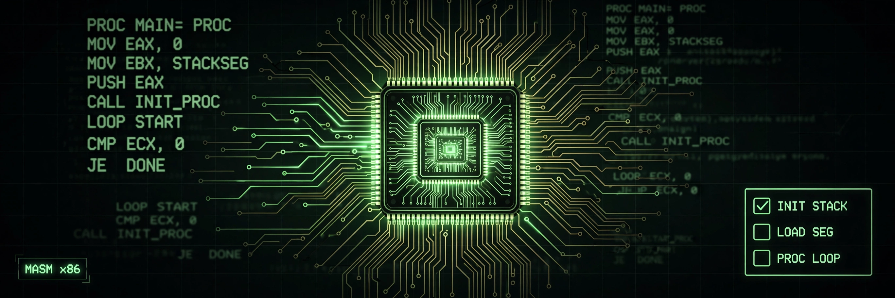

<div align="center">

# 📝 To-Do List in Assembly Language

**A console to-do list manager written in x86 assembly (MASM) with the Irvine32 library — my Computer Organization & Assembly Language (COAL) course project.**

[](https://en.wikipedia.org/wiki/X86_assembly_language)
[](https://learn.microsoft.com/en-us/cpp/assembler/masm/)
[](http://asmirvine.com/)
[](https://visualstudio.microsoft.com/)
[](https://www.microsoft.com/windows)

</div>

---

## 📸 Preview



## 📖 About

This project proves a point: you can build a genuinely useful program — menus, input validation, file persistence — with nothing but registers, memory addresses, and system calls. It's a fully working to-do list that runs in the Windows console: add tasks with due dates, view them, mark them complete, edit or remove them, and everything is saved to `todo.txt` so your list survives between runs.

The whole program lives in one file, `COALPROJECT/main.asm` (~700 lines), written in MASM syntax using Kip Irvine's Irvine32 library for console and file I/O.

## ✨ Features

| # | Menu option | What it does |
|---|---|---|
| 1 | Add Task | Enter a description and due date (`MM/DD/YYYY`) |
| 2 | View Tasks | Lists all tasks as `1. Buy groceries: 06/15/2025 [pending]` |
| 3 | Mark Task Completed | Flips a task's status from `[pending]` to `[completed]` |
| 4 | Edit Task | Change the description/date, resets status to pending |
| 5 | Remove Task | Deletes the task; remaining tasks shift up in memory |
| 6 | Exit | Auto-saves everything to `todo.txt` |

Tasks auto-load from `todo.txt` on startup, so nothing is lost when you quit.

## 🛠️ Tech Stack

| Layer | Technology |
|---|---|
| Language | x86 32-bit Assembly (MASM syntax) |
| I/O library | Irvine32 (`Irvine32.inc` — Kip Irvine's library) |
| Project format | Visual Studio C++ project (`.vcxproj` + `.slnx`) |
| Storage | Plain-text `todo.txt`, one task per line |
| Platform | Windows (Win32) |

## 🔧 How It Works (the interesting bits)

- **Parallel arrays** in the `.DATA` segment hold up to 100 tasks: `taskDescriptions` (100 × 100 bytes), `taskDates` (100 × 12 bytes), and `taskCompletionStatus` (100 bytes, `0` = pending, `1` = completed).
- **Removing a task** shifts the remaining entries with `rep movsb` and zeroes the last slot.
- **File I/O** goes through Irvine32 procedures: `OpenInputFile`, `ReadFromFile`, `CreateOutputFile`, `WriteToFile`, `CloseFile`.
- **Console I/O** uses `ReadString`, `ReadInt`, `WriteString`, `WriteDec`, `Crlf`.
- Code is organized into procedures (`AddTask`, `ViewTasks`, `MarkCompleted`, `EditTask`, `RemoveTask`, `LoadTasks`, `SaveTasks`) declared with `PROTO` and defined with `PROC`/`ENDP`.

## 🚀 Build & Run

### Option 1 — Visual Studio (recommended)

1. Clone the repo: `git clone https://github.com/hussnainahmedd/To-Do-List-in-Assembly-Language-.git`
2. Open `COALPROJECT.slnx` in Visual Studio (with MASM build support enabled).
3. Build the **Win32** configuration (Irvine32 is a 32-bit library) and run with **Ctrl+F5**.

### Option 2 — Command line (MASM)

With MASM (`ml.exe`) and the Irvine32 library installed and on your path:

```bat
ml /c /coff COALPROJECT\main.asm
link /subsystem:console main.obj irvine32.lib kernel32.lib
main.exe
```

> 💡 The Irvine32 library isn't part of a standard Windows install — grab it from [asmirvine.com](http://asmirvine.com/) and make sure `Irvine32.inc` / `irvine32.lib` are visible to the assembler and linker.

## 📂 Project Structure

```
To-Do-List-in-Assembly-Language-/
├── README.md
├── COALPROJECT.slnx        # Visual Studio solution
├── todo.txt                # Task storage (created/updated by the app)
└── COALPROJECT/
    ├── main.asm            # The entire program (~700 lines)
    ├── COALPROJECT.vcxproj # Project file (MASM build step, Win32/x64)
    └── Debug/              # Build outputs
```

## ⚠️ Known Limitations

- The file buffer is ~500 bytes, so very long task lists can get truncated when loading.
- No duplicate detection — you can add the same task twice.
- Dates aren't validated (`99/99/9999` will be accepted happily).

---

<div align="center">

Built by **Hussnain Ahmad** — learning by building, one project at a time.
<br>
https://github.com/hussnainahmedd

</div>
